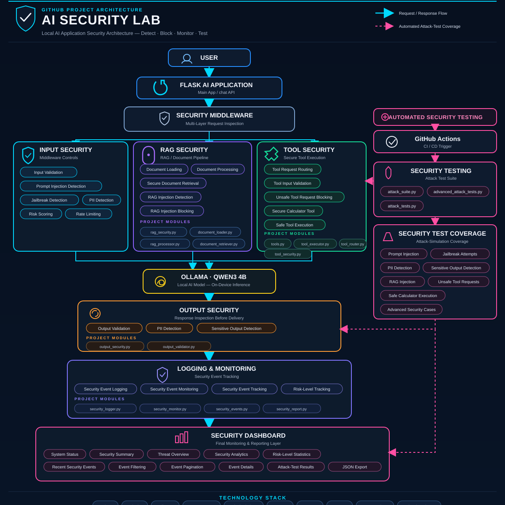
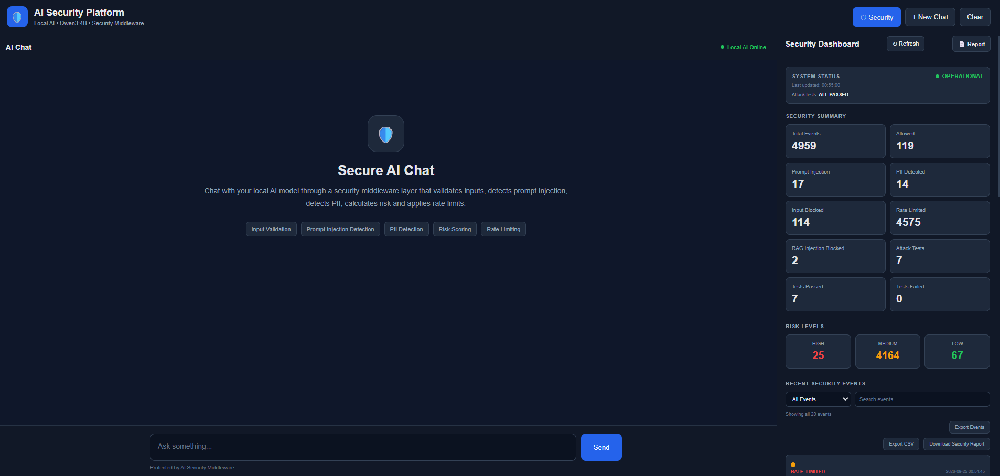
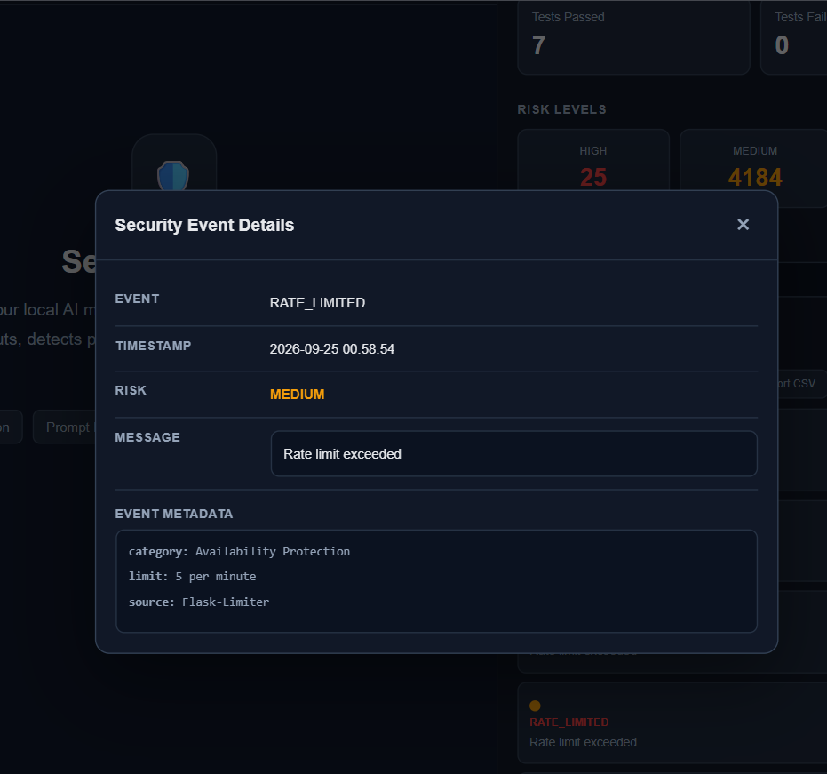

# AI Security Lab

A local AI security project built to understand how security can be added to an AI application.

The project uses Flask for the application, Ollama for running the AI model locally, and Qwen3 4B as the local language model.

---

## Overview

AI Security Lab started as a simple local AI chatbot and was then extended with different security controls.

The main idea is to check user requests before they reach the AI model and check the AI response before it is returned to the user.

The project currently includes:

- Prompt injection detection
- Jailbreak detection
- PII detection
- Risk scoring
- Input validation
- Rate limiting
- RAG security
- Tool security
- Output security
- Security logging
- Security monitoring
- Automated security testing

The AI model runs locally through **Ollama**, so the basic application does not depend on a cloud AI API.

---

## Security Architecture

<p align="center">
  
</p>

The main request flow looks like this:

```text
User
  ↓
Flask API
  ↓
Input Security
  ↓
RAG Security / Tool Security
  ↓
Ollama / Qwen3 4B
  ↓
Output Security
  ↓
Logging & Monitoring
  ↓
Security Dashboard
```

The security controls are placed around the AI model instead of treating the model as the only part of the application that needs protection.

---

## Features

### AI Security

The input security layer checks requests before they are processed by the AI model.

It includes:

- Prompt injection detection
- Jailbreak detection
- PII detection
- Risk scoring
- Input validation
- Rate limiting
- Sensitive output detection
- Output validation

### RAG Security

The project also includes a basic RAG security layer for working with documents.

It handles:

- Document loading
- Document processing
- Document retrieval
- RAG injection detection
- RAG injection blocking

The retrieved content is checked before it is passed further into the AI workflow.

### Tool Security

The project includes a calculator tool to demonstrate how AI tool requests can be controlled.

The tool security layer handles:

- Tool request routing
- Tool validation
- Tool input validation
- Unsafe tool request blocking
- Safe tool execution

The calculator only accepts expressions that match the allowed format instead of executing arbitrary input.

### Security Monitoring

Security events are recorded so that activity can be reviewed later.

The monitoring system includes:

- Security event logging
- Security event monitoring
- Risk-level tracking
- Security event filtering
- Event pagination
- Event details
- JSON event export
- CSV event export
- Security report generation

---

## Security Dashboard

The project includes a web-based security dashboard.

The dashboard is used to monitor the security activity of the application instead of checking log files manually.

It currently includes:

- System status
- Security summary
- Threat overview
- Security analytics
- Risk-level statistics
- Recent security events
- Event filtering
- Event pagination
- Event details
- Attack-test results
- JSON event export
- CSV event export
- Security report download

---

## Security Demonstration

The following examples show how some of the security controls work.

### Normal Request

A normal request goes through the input security layer before reaching the local AI model.

```text
User Request
     ↓
Input Security
     ↓
Risk Assessment
     ↓
Ollama / Qwen3 4B
     ↓
Output Security
     ↓
Response
```

### Prompt Injection

A suspicious prompt-injection request can be detected and blocked before reaching the AI model.

```text
Malicious Request
        ↓
Prompt Injection Detection
        ↓
Risk Scoring
        ↓
Request Blocked
        ↓
Security Event Logged
```

### Jailbreak Detection

Jailbreak-style requests are checked by the security middleware.

When detected, the request is blocked and recorded as a security event.

```text
Jailbreak Attempt
        ↓
Jailbreak Detection
        ↓
HIGH Risk
        ↓
Request Blocked
        ↓
Security Event Logged
```

### PII Detection

The application checks user input for sensitive personal information.

If sensitive information is detected, the request can be blocked before it reaches the AI model.

```text
User Input
    ↓
PII Detection
    ↓
Sensitive Information Found
    ↓
Request Blocked
    ↓
Security Event Logged
```

### RAG Security

Retrieved documents are also checked for suspicious instructions.

```text
Document
    ↓
Document Processing
    ↓
Document Retrieval
    ↓
RAG Security
    ↓
Malicious Context?
   ↙        ↘
 Yes        No
  ↓          ↓
Block      Continue
```

### Tool Security

Tool requests are sent through the tool router and validation layer before execution.

```text
User Request
     ↓
Tool Router
     ↓
Tool Validation
     ↓
Safe Tool?
   ↙      ↘
 Yes      No
  ↓        ↓
Execute   Block
```

### Output Security

The response generated by the AI model is checked before being returned.

```text
AI Response
     ↓
Output Validation
     ↓
PII Detection
     ↓
Sensitive Output Detection
     ↓
Safe Response
```

### Security Monitoring

Important security events are written to the security log and then displayed through the dashboard.

```text
Security Event
      ↓
Security Logger
      ↓
Security Monitoring
      ↓
Security Dashboard
```

---

## Project Screenshots

### Security Dashboard

<p align="center">
  
</p>

### Security Event Details

<p align="center">
  
</p>

---

## Attack Testing

The project includes automated tests for different AI security scenarios.

The attack testing covers:

- Prompt injection
- Jailbreak attempts
- PII detection
- Sensitive output detection
- RAG injection
- Unsafe tool requests
- Safe calculator execution
- Additional advanced security cases

The normal pytest suite currently contains 44 tests.

The latest local test run completed successfully:

```text
================ 44 passed in 2.44s ================
```

The project also contains separate attack-testing scripts for testing security controls against different types of malicious or suspicious input.

---

## Technology Stack

| Technology | Purpose |
|---|---|
| Python | Main programming language |
| Flask | Web application and API |
| Ollama | Local AI model runtime |
| Qwen3 4B | Local language model |
| Flask-Limiter | Rate limiting |
| Pytest | Automated testing |
| HTML | Dashboard structure |
| CSS | Dashboard styling |
| JavaScript | Dashboard functionality |
| Git | Version control |
| GitHub Actions | Automated security testing |

---

## Project Structure

```text
AI-Security-Lab/
│
├── app/
│   ├── main.py
│   ├── ollama_client.py
│   ├── tools.py
│   ├── tool_executor.py
│   ├── tool_router.py
│   └── templates/
│
├── security/
│   ├── input_validator.py
│   ├── prompt_detector.py
│   ├── jailbreak_detector.py
│   ├── pii_detector.py
│   ├── risk_scorer.py
│   ├── output_security.py
│   ├── output_validator.py
│   ├── security_logger.py
│   ├── security_monitor.py
│   ├── security_events.py
│   ├── security_report.py
│   ├── rag_security.py
│   ├── document_loader.py
│   ├── rag_processor.py
│   ├── document_retriever.py
│   └── tool_security.py
│
├── tests/
│   ├── test_chat.py
│   ├── test_security.py
│   ├── test_jailbreak_detector.py
│   ├── test_output_security.py
│   ├── test_output_validator.py
│   ├── test_pii_detector.py
│   ├── test_rag_security.py
│   ├── test_risk_scorer.py
│   ├── test_tool_router.py
│   ├── test_tool_security.py
│   ├── test_tools.py
│   ├── ai_attack_suite.py
│   ├── advanced_attack_tests.py
│   └── attack_tests.py
│
├── data/
│   ├── documents/
│   └── reports/
│
├── docs/
│   ├── architecture.svg
│   └── screenshots/
│
├── .github/
│   └── workflows/
│       └── security-tests.yml
│
├── requirements.txt
├── pytest.ini
├── README.md
└── .gitignore
```

---

## Requirements

Before running the project, make sure the following are installed:

- Python 3.14
- Ollama
- Git

### Supported Operating Systems

The project can be used on:

- Windows
- Linux
- macOS

---

## Local Setup

### 1. Clone the Repository

```bash
git clone https://github.com/Rxnveer0x/AI-Security-Lab.git
```

```bash
cd AI-Security-Lab
```

### 2. Create a Virtual Environment

```bash
python -m venv .venv
```

### 3. Activate the Virtual Environment

#### Windows PowerShell

```powershell
.venv\Scripts\Activate.ps1
```

#### Linux / macOS

```bash
source .venv/bin/activate
```

### 4. Install Dependencies

```bash
pip install -r requirements.txt
```

---

## Ollama Setup

Install **Ollama** and make sure it is running.

### Pull the AI Model

```bash
ollama pull qwen3:4b
```

### Verify the Model

```bash
ollama list
```

The `qwen3:4b` model should appear in the list.

---

## Run the Application

Start the Flask application:

```bash
python -m app.main
```

The application runs locally at:

```text
http://127.0.0.1:5000
```

Open the address in a browser to use the application.

---

## Run Security Tests

### Complete Test Suite

Run the complete automated test suite with:

```bash
python -m pytest -v
```

The current verified result is:

```text
44 passed in 2.44s
```

### AI Attack Suite

```bash
python -m tests.ai_attack_suite
```

### Advanced Attack Tests

```bash
python -m tests.advanced_attack_tests
```

---

## GitHub Actions

The project includes a GitHub Actions workflow for running the security tests automatically.

The workflow runs when:

- Code is pushed to the `master` branch
- A pull request is created for the `master` branch

### Workflow File

```text
.github/workflows/security-tests.yml
```

The workflow installs the project dependencies and runs the pytest suite.

---

## Security Reports

Security reports and attack-test results are stored in:

```text
data/reports/
```

The project can generate reports containing information about security events and attack-test results.

---

## Security Event Monitoring

Security events are recorded with information such as:

- Timestamp
- Event type
- Message
- Risk level
- Security metadata

These events can then be viewed through the dashboard.

### Event Management

The dashboard provides:

- Event filtering
- Event pagination
- Event details
- JSON export
- CSV export
- Security report generation

---

## Security Controls

The application has security controls at different stages of the AI request lifecycle.

### Input Security

```text
User Input
    │
    ├── Input Validation
    ├── Prompt Injection Detection
    ├── Jailbreak Detection
    ├── PII Detection
    ├── Risk Scoring
    └── Rate Limiting
```

### RAG and Tool Security

```text
Request
   │
   ├── RAG Security
   │      ├── Document Processing
   │      ├── Document Retrieval
   │      └── RAG Injection Detection
   │
   └── Tool Security
          ├── Tool Routing
          ├── Input Validation
          └── Unsafe Tool Blocking
```

### Output Security

```text
AI Response
    │
    ├── Output Validation
    ├── PII Detection
    └── Sensitive Output Detection
```

---

## Project Goal

I built this project to get practical experience with AI security.

Instead of only creating a chatbot, I wanted to understand what security controls can be placed around an AI application.

The project focuses on:

- LLM security
- Prompt injection
- Jailbreak detection
- PII protection
- RAG security
- Tool security
- Output security
- Security monitoring
- Automated security testing

---

## Learning Focus

While working on the project, I practiced:

- Python
- Flask
- Local LLM integration
- AI application security
- Prompt injection defense
- Jailbreak detection
- PII detection
- Risk scoring
- RAG security
- Tool validation
- Output security
- Security logging
- Security monitoring
- Automated testing
- Git and GitHub
- GitHub Actions

---

## Author

**Ranveer Singh**

---

## GitHub

**Repository:**

https://github.com/Rxnveer0x/AI-Security-Lab